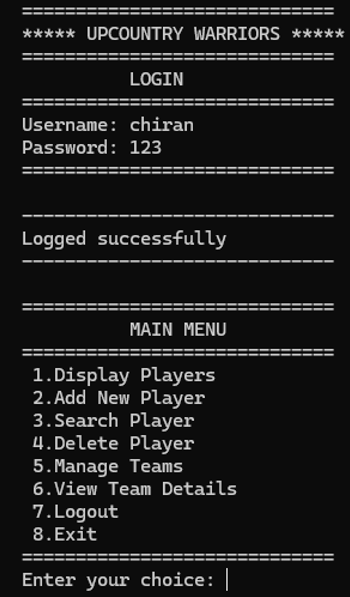
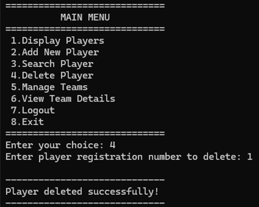

# 🛡️ Upcountry Warriors – C++ Console Management System

A fully functional **C++ console-based system** designed to manage the **Upcountry Warriors Club**, built using **Object-Oriented Programming (OOP)** concepts.  
Includes login authentication, player management, team management, and persistent file storage.

---

## 📌 Key Features

### 🔐 Login System
- Predefined username/password (`chiran / 123`)
- Prevents unauthorized access  
- Loops until correct login

### 👥 Player Management
- Add new players  
- Display all players  
- Search players by registration number  
- Delete existing players  
- Assign up to **2 teams per player**

### 🏆 Team Management
- Add teams  
- Delete teams  
- Display all registered teams  
- View team details (shows all players belonging to a team)

### 💾 File Storage
- All player details are saved in `players.txt`
- Automatically loads on startup  
- Writes updated records on add/delete

### 🧠 OOP Concepts Used
- Classes  
- Encapsulation  
- Struct  
- File handling  
- Arrays  
- Switch-case menus  

---

## 📸 Screenshots

### 🔐 Login Screen

### ➕ Add Player

### 🗑️ Delete Player

---

## 🧰 Technologies Used
- **Language:** C++  
- **Compiler:** g++ / MinGW / Visual Studio / CodeBlocks  
- **Paradigm:** Object-Oriented Programming  

---

## 📂 Folder Structure
